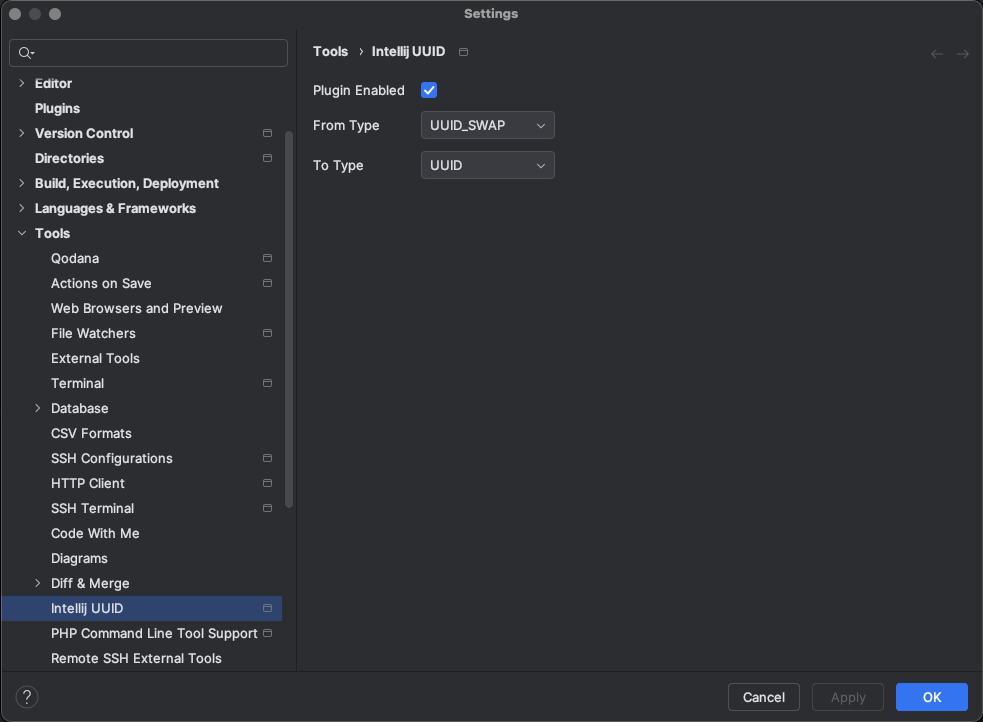

# intellij-database-uuid

[//]: # ([![Version]&#40;https://img.shields.io/jetbrains/plugin/v/MARKETPLACE_ID.svg&#41;]&#40;https://plugins.jetbrains.com/plugin/MARKETPLACE_ID&#41;)
[//]: # ([![Downloads]&#40;https://img.shields.io/jetbrains/plugin/d/MARKETPLACE_ID.svg&#41;]&#40;https://plugins.jetbrains.com/plugin/MARKETPLACE_ID&#41;)

<!-- Plugin description -->
Tiny plugin to change default binary UUID presentation in Database Tools.
<!-- Plugin description end -->

## Installation

[//]: # (- Using the IDE built-in plugin system:)

[//]: # (  )
[//]: # (  <kbd>Settings/Preferences</kbd> > <kbd>Plugins</kbd> > <kbd>Marketplace</kbd> > <kbd>Search for "intellij-database-uuid"</kbd> >)

[//]: # (  <kbd>Install</kbd>)

[//]: # (  )
[//]: # (- Using JetBrains Marketplace:)

[//]: # ()
[//]: # (  Go to [JetBrains Marketplace]&#40;https://plugins.jetbrains.com/plugin/MARKETPLACE_ID&#41; and install it by clicking the <kbd>Install to ...</kbd> button in case your IDE is running.)

[//]: # ()
[//]: # (  You can also download the [latest release]&#40;https://plugins.jetbrains.com/plugin/MARKETPLACE_ID/versions&#41; from JetBrains Marketplace and install it manually using)

[//]: # (  <kbd>Settings/Preferences</kbd> > <kbd>Plugins</kbd> > <kbd>⚙️</kbd> > <kbd>Install plugin from disk...</kbd>)

- Manually:

  Download the [latest release](https://github.com/sam0delkin/intellij-database-uuid/releases/latest) and install it manually using
  <kbd>Settings/Preferences</kbd> > <kbd>Plugins</kbd> > <kbd>⚙️</kbd> > <kbd>Install plugin from disk...</kbd>

---
Plugin based on the [IntelliJ Platform Plugin Template][template].

[template]: https://github.com/JetBrains/intellij-platform-plugin-template
[docs:plugin-description]: https://plugins.jetbrains.com/docs/intellij/plugin-user-experience.html#plugin-description-and-presentation
